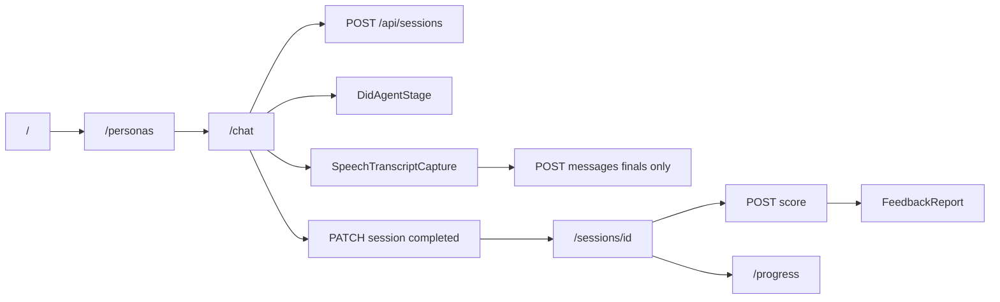

# No-scaffold execution map

**Branch:** `commercial-v1`  
**Base commit:** `3edbb0c`  
**Active app:** `conversate/web`  
**Date:** 2026-05-21

## Fix order (from hard audit)

| P | Component | Action |
|---|-----------|--------|
| P0 | DidAgentStage / D-ID CORS | Actionable error panel + did-local-debugging.md |
| P1 | Gemini scoring | Heuristic fallback + degraded labeling |
| P2 | Vitest | Add `npm run test` |
| P3 | Biome lint | format + unused vars |
| P4 | Admin sub-pages | Shell OK for MVP; auth hardened on mutations |

## Route classification

| Route | Status | Notes |
|-------|--------|-------|
| `/` | **real** | Sakura landing |
| `/personas` | **real** | Five personas |
| `/chat` | **real** | Session + D-ID + speech |
| `/sessions` | **real** | DB list |
| `/sessions/[id]` | **real** | Transcript + score + feedback |
| `/progress` | **real** | DB or labeled demo |
| `/admin` | **real** | Metrics overview |
| `/admin/personas` | **real** | Persona table (no secrets) |
| `/admin/sessions` | **real** | Session list |
| `/admin/kb` | **scaffold** | Copy only |
| `/admin/scoring` | **scaffold** | Copy only |
| `/admin/cost` | **scaffold** | Copy only |
| `/admin/scraper-runs` | **scaffold** | Copy only |
| `/admin/audit-log` | **scaffold** | Copy only |
| `/settings`, `/analytics` | **real** | Info pages |
| `/api/health`, `/api/personas` | **real** | |
| `/api/sessions/*` | **real** | |
| `/api/kb/chunks/import` | **real** | Admin-gated |
| `/api/chat`, `/api/opening` | **dormant** | V1 D-ID brain |
| `/api/admin/*` | **missing** | Not in codebase |

## Component classification (A–E)

| Component | Grade | Notes |
|-----------|-------|-------|
| Sakura UI | A | Working |
| Session API + Prisma | A | Working when DATABASE_URL set |
| SpeechTranscriptCapture | B | Final-only; metadata not in DB |
| DidAgentStage | B/D | Broken in embedded browser (CORS) |
| scorer.ts | B | Stub on 429; needs heuristics |
| Sessions/progress pages | A/B | Mostly real |
| Admin authz | B | Dev header only; needs prod guard |
| Vitest | E | Missing |
| KB policy | A | kb:smoke passes |

## Schema limitation (transcript)

`Message` model has `role`, `content`, `sequence` only. API accepts `provider`/`metadata` but `appendMessages` strips them. UI shows source labels from client state only.

## Chrome verification checklist

- [ ] `http://localhost:3000/` — hero + persona cards
- [ ] `/personas` — five cards, Open chat
- [ ] `/chat?persona=amazon-l5-bar-raiser` — session ready, speech panel, D-ID connects
- [ ] `/chat?persona=google-l4-swe` — no stuck preflight
- [ ] Speech: consent, start capture, finals in panel (no interim POST)
- [ ] Manual transcript save works
- [ ] End session → `/sessions` → detail
- [ ] Generate score (live or degraded banner)
- [ ] `/progress` — live or demo banner
- [ ] `/admin` — metrics, no secrets

## App graph (MVP path)

