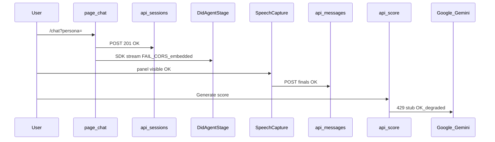

# Repo health graph — Conversate

**Audit date:** 2026-05-22 (golden-path reliability pass)  
**Git:** `commercial-v1`  
**Machine-readable graph:** [repo-health-graph.json](./repo-health-graph.json)  
**Benchmark evidence:** [benchmark-results-2026-05-21.md](./benchmark-results-2026-05-21.md)  
**Rebuild audit:** [industry-standard-rebuild-audit.md](./industry-standard-rebuild-audit.md)

## Executive summary

The **active MVP** (`conversate/web`) completes the golden path with **transcript-only fallback** when D-ID fails. `npm run verify` passes (build + 16 unit tests + kb:smoke).

1. **D-ID live stream** — optional; degraded in embedded browser (CORS); use Chrome + allowlist or transcript-only mode.
2. **Automated tests** — Vitest + `npm run verify`; manual Chrome checklist in [demo-readiness-checklist.md](../implementation/demo-readiness-checklist.md).

**Postgres** is **working** in this audit (sessions persist; count=15). **Gemini scoring** returns HTTP 200 with **`degraded: true`** (quota stub). **KB governance smoke** passes.

**code-review-graph MCP** was unavailable during audit; JSON is the source of truth until [mcp-graph-sync.md](./mcp-graph-sync.md) is executed.

---

## Health legend

| Health | Meaning |
|--------|---------|
| working | Benchmark or browser check passed |
| degraded | Functional with fallback or non-blocking defect |
| broken | Blocks primary user flow |
| untested | No automated or manual evidence |
| dormant | Intentionally unused in V1 |
| legacy | Archive; do not extend |

---

## MVP critical path (measured)



---

## Zone map

| Zone | Paths | Tag | MVP gate |
|------|-------|-----|----------|
| Next app | `conversate/web/` | active-MVP | Yes |
| Pipelines | `pipelines/scraper`, `pipelines/kb` | offline-pipeline | No |
| Eval | `eval/rubric_eval.py` | offline-pipeline | No |
| Streamlit | `app/`, `components/` | legacy-archive | No |
| Docs | `docs/` | documentation | N/A |

---

## Component status (active-MVP)

### Working

| Node | Evidence |
|------|----------|
| Landing `/`, personas `/personas` | M01, M02 |
| Session API + DB | B06, B10 |
| Messages API | B07 |
| Speech capture UI | M05 |
| Sessions list/detail + feedback | M07, M08 |
| Progress + admin overview | M09 |
| KB policy smoke | B03 |
| KB import RBAC | B09 |
| Redis ping | curl PONG |
| Build | B01 |

### Degraded

| Node | Issue | Fix |
|------|-------|-----|
| `lib/scoring/scorer` | Gemini 429 → stub | Enable AI Studio quota or keep stub |
| `api/.../score` | Same | Same |
| `infra:biome-lint` | 68 format issues | `npm run format`; fix unused `personaId` |
| `lib/analytics/init` | No-op stub | Wire provider when needed |

### Broken

| Node | Issue | Fix (ordered) |
|------|-------|---------------|
| **`DidAgentStage` + `external:d-id-api`** | CORS in embedded browser | 1) D-ID Studio allowlist for `http://localhost:3000` 2) Test in real Chrome 3) Optional Next proxy route |
| **`infra:vitest-playwright`** | No test scripts | Add Vitest + Playwright per test-strategy |

### Dormant (not broken)

| Node | Note |
|------|------|
| `api/chat`, `api/opening`, `lib/llm` | V1 brain is D-ID Studio |

### Untested

| Node | Note |
|------|------|
| Admin shells (kb, scoring, cost, audit-log, scraper-runs) | Copy-only pages |
| `lib/kb/retrieval` | No recall@k benchmark run |
| `lib/speech/browser-speech` | M06 not verified (no mic in embedded browser) |
| `pipelines/scraper` execution | Import-only smoke |

### Legacy (no fix)

| Node | Note |
|------|------|
| `app/app.py`, `app/services/*` | Streamlit archive |
| `components/*.py` | Old UI blocks |

---

## Fix matrix (priority order)

| P | Component | Health | Root cause | Minimal fix |
|---|-----------|--------|------------|-------------|
| **P0** | D-ID live stream | broken (embedded) | CORS on `api.d-id.com` from preview origin | Allowlist localhost in D-ID Studio; verify Chrome |
| **P1** | Gemini scoring | degraded | API quota 429 | Upgrade Google AI Studio quota |
| **P2** | Test harness | broken | Missing Vitest/Playwright | Add `test` script + 3 unit tests + 1 Playwright smoke |
| **P3** | Biome lint | degraded | Format drift | `npm run format` |
| **P4** | Admin sub-pages | untested | Shell UI | Implement queue tables or link to external tools |
| **P5** | D-ID proxy (optional) | — | Repeated CORS in non-Chrome envs | `GET /api/did/agent/[id]` server-side proxy |

---

## Offline / legacy graph

```mermaid
flowchart LR
  scraper[pipelines_scraper] --> kbImport[api_kb_import]
  kbPy[pipelines_kb_python] -.-> kbPolicy[lib_kb_policy]
  streamlit[legacy_app] -.x web[conversate_web]
```

Scraper output is intended to flow through **admin-gated** KB import, not directly into live RAG.

---

## MCP graph memory

See [mcp-graph-sync.md](./mcp-graph-sync.md) for backfill steps when `user-code-review-graph` is restored.

---

## Related docs

- [current-mvp-status.md](../implementation/current-mvp-status.md) — updated from this audit
- [ARCHITECTURE.md](../ARCHITECTURE.md)
- [test-strategy.md](../implementation/test-strategy.md)
